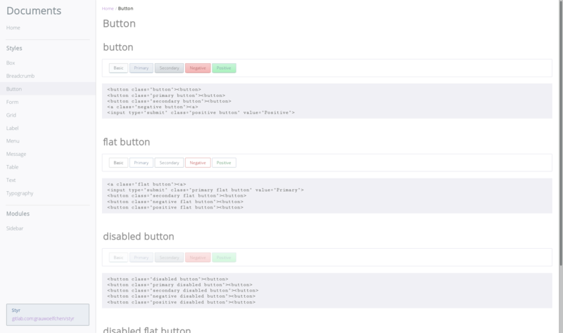

# Styr

`/stɪ́əɾ/`

[![pipeline status][pipeline]][commit] [![npm version][version]][npm]

[](
https://gitlab.com/grauwoelfchen/styr/raw/master/doc/img/screenshot.png)

```txt
 ____  _
/ ___|| |_ _   _ _ __
\___ \| __| | | | '__|
 ___) | |_| |_| | |
|____/ \__|\__, |_|
           |___/

Styr; STYlish css libRary
```

## Repository

https://gitlab.com/grauwoelfchen/styr


## Dependencies

* [normalize.css](https://github.com/necolas/normalize.css)


## Install

```zsh
% npm install --save styr
```


## Features

See `doc/index.html`

### Styles

* [Button](https://grauwoelfchen.gitlab.io/styr/button.html)
* [Form](https://grauwoelfchen.gitlab.io/styr/form.html)
* [Grid](https://grauwoelfchen.gitlab.io/styr/grid.html)
* [Label](https://grauwoelfchen.gitlab.io/styr/label.html)
* [Table](https://grauwoelfchen.gitlab.io/styr/table.html)
* [Text](https://grauwoelfchen.gitlab.io/styr/text.html)
* [Typography](https://grauwoelfchen.gitlab.io/styr/typography.html)


### Components

* [Box](https://grauwoelfchen.gitlab.io/styr/box.html)
* [Breadcrumb](https://grauwoelfchen.gitlab.io/styr/breadcrumb.html)
* [Menu](https://grauwoelfchen.gitlab.io/styr/menu.html)
* [Message](https://grauwoelfchen.gitlab.io/styr/message.html)
* [Modal](https://grauwoelfchen.gitlab.io/styr/modal.html)
* [Pagination](https://grauwoelfchen.gitlab.io/styr/pagination.html)
* [Dropdown](https://grauwoelfchen.gitlab.io/styr/dropdown.html)
* [Sidebar](https://grauwoelfchen.gitlab.io/styr/sidebar.html)


## Documentation

https://grauwoelfchen.gitlab.io/styr


## Development

### Requirements

* Node.js `8.9.0`

### Setup

```zsh
: e.g. use nodeenv
% python3.5 -m venv venv
% source venv/bin/activate
(venv) % pip install --upgrade pip setuptools
(venv) % pip install nodeenv
(venv) % nodeenv -p --node=8.9.0

(venv) % npm i -g npm
(venv) % npm i
```

### Document

```zsh
: open local document
% xdg-open doc/index.html
```

### Lint

```zsh
: check gulpfile.js
% npm install -g eslint
% eslint gulpfile.js
```

### Build

```zsh
: build assets
% npm install -g gulp-cli
% gulp
```


## License

This program is free software: you can redistribute it and/or modify it
under the terms of the MIT License.


See [LICENSE](LICENSE).


```txt
Styr
Copyright (c) 2017-2018 Yasuhiro Asaka
```


[pipeline]: https://gitlab.com/grauwoelfchen/styr/badges/master/pipeline.svg
[commit]: https://gitlab.com/grauwoelfchen/styr/commits/master
[version]: https://img.shields.io/npm/v/styr.svg
[npm]: https://www.npmjs.com/package/styr
